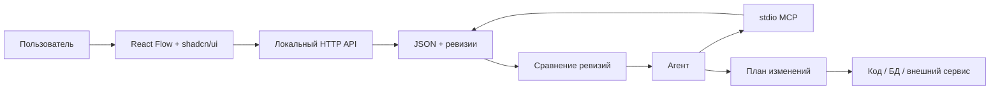

# Архитектура Relationship Map

## Контракты

- `server/schema.ts`: нейтральные узлы и связи. `sourceRefs` позволяет ссылаться на код, объекты БД и URL. Поля старой карты сохраняются.
- `server/store.ts`: чтение, сохранение с ожидаемой ревизией, история и сравнение. Каталог ограничен именами карт без путей; изменения записываются атомарно.
- `server/http.ts`: локальный API для React редактора. Слушает только `127.0.0.1`.
- `server/mcp.ts`: инструменты агента. MCP и HTTP используют одно хранилище, но запускаются разными процессами.
- `src/App.tsx`: выбор, создание и редактирование карт, узлов и связей. Не содержит кода интеграции с БД или конкретным репозиторием.

## Работа с изменённой пользователем схемой

1. Агент читает карту и запоминает `revision`.
2. Пользователь меняет карту в редакторе и сохраняет.
3. Агент вызывает `get_map_changes` с прежней ревизией.
4. Агент отличает косметическое перемещение от смысловых изменений названий, типов, связей и источников.
5. Если пользователь просит реализовать изменения, агент проверяет реальные объекты и код, составляет декомпозицию, затем действует по правилам целевого проекта.

Карта не является исполняемым blueprint. MCP намеренно не предоставляет инструмент «применить схему к коду или БД»: универсальное применение без знания целевого проекта не может гарантировать корректность. Для конкретного проекта будущий адаптер может строить предложения или проверяемые патчи, оставляя решение за пользователем и правилами проекта.

## Следующие слои

- Адаптеры чтения связей из конкретного репозитория, схемы PostgreSQL или другого источника. Они должны подтверждать источник каждой связи и отделять вывод модели от факта.
- Синхронизация с Git или общим хранилищем для нескольких пользователей. Нынешние JSON и файловые блокировки рассчитаны на один компьютер.
- MCP Apps или аналогичная поверхность для открытия редактора прямо внутри клиента агента. Нынешний React редактор запускается как локальная веб-страница.
